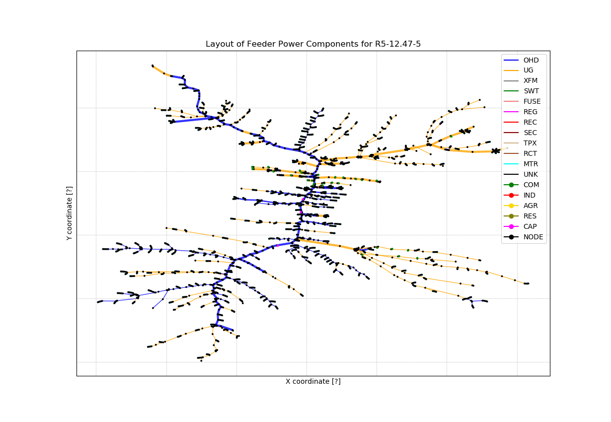

# Taxonomy Feeder Model Utilities

The original taxonomy feeders have been updated as follows:

* more realistic transformer impedance and core parameters
* use only standard single-phase and three-phase transformer sizes
* more appropriate secondary and load voltages, based on the size and type of load
* alleviate line, cable and transformer overloads
* choose fuse current limits from standard fuse, recloser and breaker sizes 
* add margin to fuse current limits so they don't blow during steady state. _Note: This had to be redone because the new load voltage levels increased many of the component currents._
* assign capacitor nominal voltages based on the nominal primary voltage
* incorporate the [xy coordinates](http://emac.berkeley.edu/gridlabd/taxonomy_graphs/) from Michael A. Cohen 
  - Note: The xy coordinates are used in GridAPPS-D, CIM and OpenDSS, but not standalone GridLAB-D
  - As of November 2019, the above link may be inactive, but the coordinates have been stored on this repository. Also, see https://escholarship.org/uc/item/8rt4k5hh for Cohen's thesis.
* remove assertion statements

The solution results change, so GridLAB-D regression tests
may continue using the original taxonomy feeders from the GridLAB-D
repository. The updated taxonomy feeders are recommended for research
projects, as the updates produce more realistic results, especially
for voltage and overload questions.

## Updating the Taxonomy Feeders

In order to fix overloads in the taxonomy feeders, and create graph-based representations:

1. [Python 3.x](https://www.python.org/downloads/) and the [NetworkX 2.4](https://networkx.github.io/) package are required.
2. From a command prompt in the ```taxonomy``` subdirectory, invoke ```python3 FixTransformers.py```
3. Based on ```./base_taxonomy/orig*.glm```, this creates the updated taxonomy feeders in ```./base_taxonomy/new*.glm```
4. From a command prompt in ```taxonomy/base_taxonomy```, invoke
 	* ```run_all_new``` (on Windows)
 	* ```chmod +x *.sh``` and then ```run_all_new.sh``` (on Linux or Mac OS X)
5. Twenty-four GridLAB-D simulations should run without errors or significant warnings

## GridLAB-D to OpenDSS Conversion

After processing the taxonomy updates, OpenDSS conversion proceeds as follows:

1. From a command prompt in the ```taxonomy``` subdirectory, invoke ```python3 converter_gld_dss.py```
2. This will create twenty-four directories like _./new_GC_12_47_1_ with an OpenDSS model and bus coordinates in several files
3. From a command prompt in one of those subdirectories, invoke ```opendsscmd Master.dss``` to run the simulation
 	* _opendsscmd_ is the cross-platform solver used in GridAPPS-D. 
 	* You may also use the Windows GUI version, _OpenDSS.exe_, to open and solve _Master.dss_ 

## Plotting the Taxonomy Feeders

Based on the updated taxonomy feeders and OpenDSS conversion, you can plot a graphical representation of each taxonomy feeder, as illustrated below.

1. [Matplotlib 3.1.1](https://matplotlib.org) is required.
2. Invoke ```python3 FixTransformers.py``` again to incorporate node coordinates into the JSON files.
3. Invoke ```python3 plot_feeder.py R5-12.47-5``` to create the color-coded example shown below. Line widths are weighted by the number of phases. Use this plot to find points of interest based on the colors.
4. Invoke ```python3 plot_feeder.py R5-12.47-5 1``` to create a version of the plot with node labels.  This is too cluttered to read without zooming in, so it's best used in conjunction with the unlabelled plot.



If you didn't actually change the taxonomy feeders, then you can plot any of them based on JSON files from the repository, e.g., ```python3 plot_feeder.py GC-12.47-1 1```


